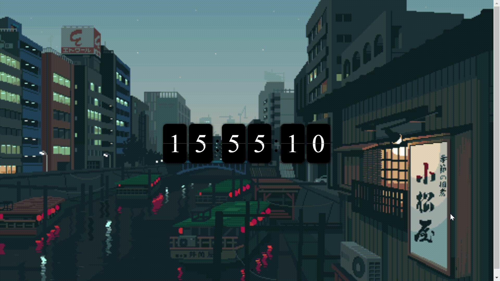

<h1>Relógio digital minimalista</h1>
<h2>Descrição do Projeto</h2>

Projeto de um relógio digital, utilizado como treino para JavaScript, utilizando também HTML5 e CSS3. Aplicando conhecimentos adquiridos no curso de programação Web(Java) do Instituto PROA.

